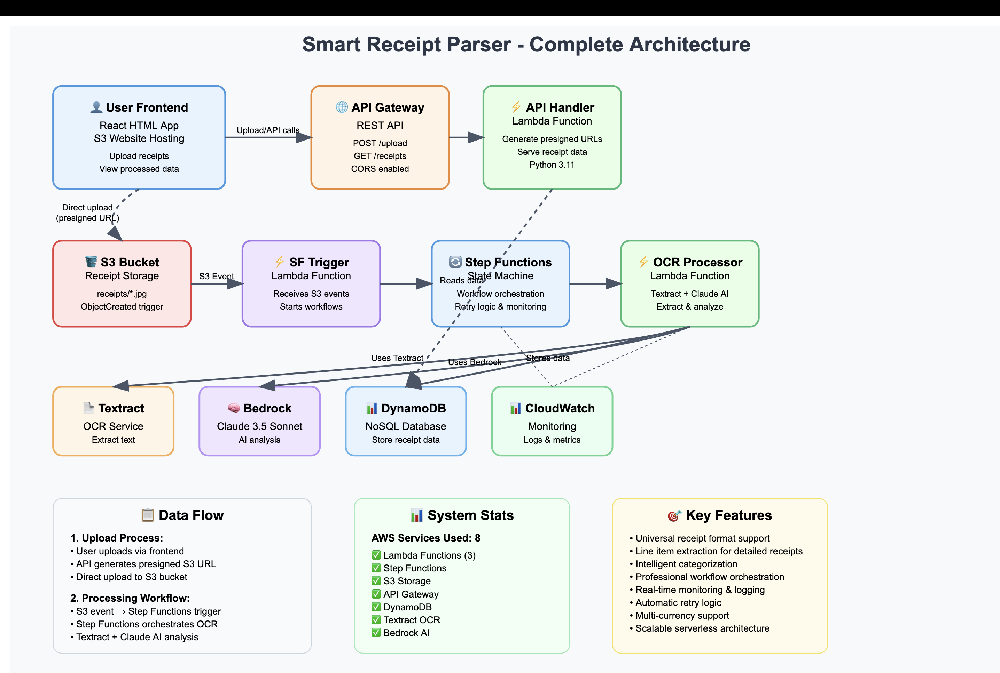

# 🧾 Smart Receipt Parser

**AI-Powered Serverless Receipt Processing System**

A sophisticated serverless application that uses AWS Lambda, Step Functions, and Claude AI to automatically extract, analyze, and categorize receipts from any format. Built for the AWS Lambda Hackathon.

## 🏗️ Architecture Overview




## 🎯 Business Problem Solved

**Expense Management Pain Points:**
- Manual receipt data entry is time-consuming and error-prone
- Different receipt formats make automation difficult  
- No intelligent categorization or line-item extraction
- Lack of real-time processing and monitoring

**Our Solution:**
Smart Receipt Parser automatically processes any receipt format, extracts detailed information including individual line items, and provides intelligent categorization with professional workflow orchestration.

## 🏗️ How AWS Lambda Powers This Application

### **Lambda as the Core Service**

This application uses **AWS Lambda extensively** as the primary compute service:

#### **1. API Handler Lambda (`api-handler`)**
- **Trigger:** API Gateway HTTP requests
- **Purpose:** Handles all REST API operations
- **Functions:**
  - Generate presigned S3 URLs for secure file uploads
  - Serve processed receipt data from DynamoDB
  - Handle CORS and authentication
- **Runtime:** Python 3.11
- **Memory:** 512MB

#### **2. Step Functions Trigger Lambda (`step-functions-trigger`)**  
- **Trigger:** S3 ObjectCreated events
- **Purpose:** Orchestrates the processing workflow
- **Functions:**
  - Receives S3 upload notifications
  - Initiates Step Functions state machine execution
  - Provides workflow metadata and tracking
- **Runtime:** Python 3.11
- **Memory:** 256MB

#### **3. OCR Processor Lambda (`ocr-processor`)**
- **Trigger:** Step Functions state machine
- **Purpose:** Core AI processing engine
- **Functions:**
  - Extracts text using AWS Textract
  - Analyzes content with Claude AI via Bedrock
  - Extracts line items, totals, and categorization
  - Stores processed data in DynamoDB
- **Runtime:** Python 3.11
- **Memory:** 1024MB
- **Timeout:** 5 minutes

### **Lambda Triggers Implemented**

1. **API Gateway Integration**
   - REST API endpoints trigger API Handler Lambda
   - Handles GET, POST, OPTIONS methods
   - Implements CORS for web frontend

2. **S3 Event Notifications**
   - S3 ObjectCreated events trigger Step Functions workflow
   - Supports multiple file formats simultaneously
   - Automatic processing pipeline initiation

3. **Step Functions Orchestration**
   - State machine orchestrates Lambda execution
   - Implements retry logic and error handling
   - Provides professional workflow monitoring

## 🛠️ AWS Services Used

| Service | Purpose | Integration |
|---------|---------|-------------|
| **AWS Lambda** | Core compute service | 3 functions handling API, orchestration, and processing |
| **AWS Step Functions** | Workflow orchestration | Orchestrates processing pipeline with retry logic |
| **Amazon S3** | File storage | Receipt upload storage and static website hosting |
| **Amazon API Gateway** | REST API | Handles frontend API requests with CORS |
| **Amazon DynamoDB** | Database | Stores processed receipt data and metadata |
| **Amazon Textract** | OCR service | Extracts text from receipt images |
| **Amazon Bedrock** | AI service | Claude AI for intelligent receipt analysis |
| **Amazon CloudWatch** | Monitoring | Logging and monitoring for all services |

## ✨ Key Features

### **Universal Receipt Processing**
- Supports any receipt format (grocery, restaurant, gas station, invoices)
- Handles multiple image formats (JPG, PNG, GIF, etc.)
- Processes receipts from any country/currency

### **Intelligent Line Item Extraction**
- Automatically detects when receipts contain itemized information
- Extracts individual items with prices, quantities, and descriptions
- Gracefully handles simple receipts without forcing fake data

### **AI-Powered Analysis**
- Claude 3 Sonnet via Amazon Bedrock for intelligent processing
- Automatic categorization (Food, Travel, Office, Healthcare, etc.)
- Confidence scoring for quality assessment
- Multi-currency support with automatic detection

### **Professional Workflow Management**
- Step Functions orchestration for enterprise-grade processing
- Automatic retry logic for failed operations
- Real-time monitoring and logging
- Visual workflow tracking in AWS Console

### **Modern Web Interface**
- React-based frontend with drag-and-drop upload
- Real-time processing status updates
- Expandable line item display for detailed receipts
- Responsive design for all devices

## 🚀 Architecture Overview

```
┌─────────────┐    ┌──────────────┐    ┌─────────────────┐
│   Frontend  │───▶│ API Gateway  │───▶│  API Handler    │
│  (S3 Web)   │    │              │    │    Lambda       │
└─────────────┘    └──────────────┘    └─────────────────┘
                                                │
                                                ▼
┌─────────────┐    ┌──────────────┐    ┌─────────────────┐
│ S3 Receipt  │───▶│ SF Trigger   │───▶│ Step Functions  │
│   Bucket    │    │   Lambda     │    │ State Machine   │
└─────────────┘    └──────────────┘    └─────────────────┘
                                                │
                                                ▼
┌─────────────┐    ┌──────────────┐    ┌─────────────────┐
│  DynamoDB   │◀───│    OCR       │◀───│   Textract +    │
│  Database   │    │  Processor   │    │    Bedrock      │
└─────────────┘    │   Lambda     │    │     (Claude)    │
                   └──────────────┘    └─────────────────┘
```

## 📦 Installation & Deployment

### Prerequisites
- AWS CLI configured with appropriate permissions
- Terraform >= 1.0
- Python 3.11
- Access to Amazon Bedrock (Claude model)

### Quick Deploy
```bash
# Clone repository
git clone https://github.com/yourusername/smart-receipt-parser
cd smart-receipt-parser

# Deploy infrastructure
./scripts/deploy.sh

# Upload frontend
aws s3 sync src/frontend/ s3://your-frontend-bucket/
```

### Manual Deployment
```bash
# Package Lambda functions
./scripts/create-lambda-zips.sh

# Deploy with Terraform
cd terraform
terraform init
terraform plan
terraform apply

# Note the API Gateway URL from outputs
```

## 🧪 Testing the Application

### 1. Access the Frontend
Open the S3 website URL provided in Terraform outputs

### 2. Upload Test Receipts
- Drag and drop any receipt image
- Watch real-time processing status
- View extracted data and line items

### 3. Monitor Processing
- Check AWS Step Functions console for workflow execution
- View CloudWatch logs for detailed processing information
- Verify data in DynamoDB console

### 4. API Testing
```bash
# Get all receipts
curl https://your-api-url/prod/receipts

# Get receipts by category
curl https://your-api-url/prod/receipts/category/Food

# Generate upload URL
curl -X POST https://your-api-url/prod/upload \
  -H "Content-Type: application/json" \
  -d '{"filename": "receipt.jpg", "contentType": "image/jpeg"}'
```

## 🎥 Demo

**Live Demo:** [Your demo URL here]

**Video Demonstration:** [YouTube/Vimeo link - under 3 minutes]

The video demonstrates:
- How AWS Lambda functions power the entire application
- Real receipt upload and processing workflow
- Step Functions orchestration in action
- AI-powered line item extraction
- Professional monitoring and logging

## 🆕 What Was Built During Hackathon

**This project was specifically created for the AWS Lambda Hackathon with the following components:**

### **Newly Created (100% new):**
- Complete serverless architecture design
- All 3 Lambda functions with full functionality
- Step Functions workflow orchestration
- React frontend with advanced UI components
- Terraform infrastructure as code
- Integration with 8 different AWS services

### **Hackathon-Specific Enhancements:**
- **Professional Workflow Orchestration:** Added Step Functions for enterprise-grade processing pipeline
- **Advanced AI Integration:** Implemented Claude 3 Sonnet via Bedrock for intelligent analysis
- **Line Item Extraction:** Built sophisticated parsing for itemized receipts
- **Universal Format Support:** Designed system to handle any receipt format
- **Monitoring & Observability:** Added comprehensive CloudWatch integration

## 📊 Performance & Scalability

- **Processing Time:** 4-8 seconds per receipt
- **Concurrent Processing:** Unlimited (serverless auto-scaling)
- **Supported Formats:** All image formats
- **Cost:** Pay-per-use serverless model
- **Availability:** 99.9% (AWS managed services)

## 🔒 Security & Compliance

- **IAM Roles:** Least privilege access for all components
- **Encryption:** Data encrypted at rest and in transit
- **CORS:** Properly configured for web security
- **Presigned URLs:** Secure direct S3 uploads
- **API Security:** Rate limiting via API Gateway

## 🤝 Contributing

This project was built for the AWS Lambda Hackathon. For questions or collaboration:

1. Fork the repository
2. Create feature branch
3. Submit pull request with detailed description

## 📄 License

MIT License - See LICENSE file for details

## 🏆 Hackathon Submission

**Category:** AWS Lambda Application
**Focus:** Real-world business automation using serverless architecture
**Innovation:** AI-powered receipt processing with professional workflow orchestration

This application demonstrates advanced AWS Lambda usage with multiple triggers, sophisticated AI integration, and enterprise-grade architecture suitable for production deployment.

---

**Built with ❤️ for the AWS Lambda Hackathon**