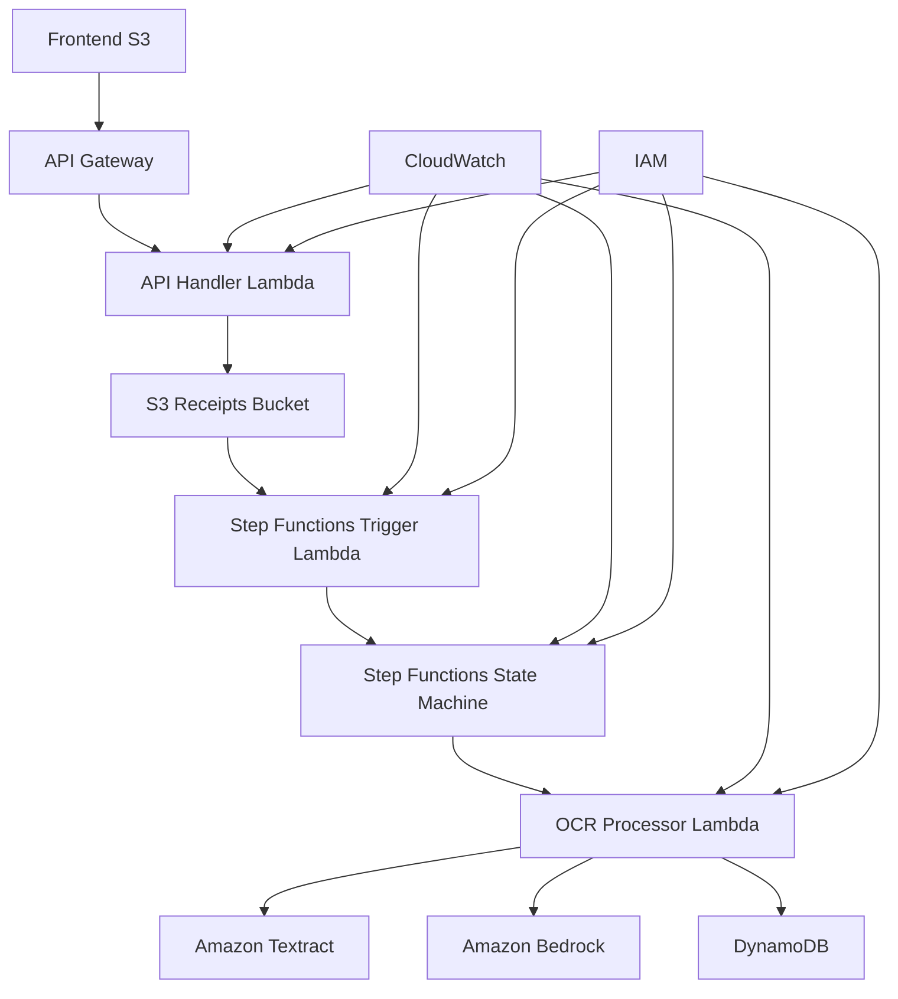

# 🛠️ AWS Services Used - Detailed Documentation

## Core Services

### 1. **AWS Lambda** ⚡
**Role:** Primary compute service
**Usage:** 
- 3 Lambda functions handle all application logic
- API Handler: Processes REST API requests and generates presigned URLs
- Step Functions Trigger: Orchestrates workflow initiation from S3 events  
- OCR Processor: Performs AI-powered receipt analysis
**Configuration:**
- Runtime: Python 3.11
- Memory: 256MB - 1024MB based on function requirements
- Timeout: 30 seconds - 5 minutes based on processing needs

### 2. **AWS Step Functions** 🔄
**Role:** Workflow orchestration
**Usage:**
- Orchestrates the entire receipt processing pipeline
- Implements retry logic with exponential backoff
- Provides visual workflow monitoring and error handling
- Logs all execution steps for debugging and monitoring
**Configuration:**
- State machine with task, success, and failure states
- CloudWatch integration for detailed logging
- IAM roles for secure service access

## Storage Services

### 3. **Amazon S3** 🪣
**Role:** Object storage and web hosting
**Usage:**
- Receipt upload storage with organized folder structure (`receipts/`)
- Static website hosting for React frontend
- Presigned URLs for secure direct uploads
- CORS configuration for web application access
**Configuration:**
- Two buckets: receipts storage and frontend hosting
- Public read access for frontend bucket
- Event notifications for processing triggers

### 4. **Amazon DynamoDB** 🗄️
**Role:** NoSQL database
**Usage:**
- Stores processed receipt data with line items
- Supports complex nested objects for detailed receipts
- Fast queries for frontend data retrieval
- Automatic scaling based on demand
**Configuration:**
- Pay-per-request billing mode
- Primary key: receiptId (UUID)
- Supports both simple and complex receipt data structures

## API & Integration Services

### 5. **Amazon API Gateway** 🌐
**Role:** REST API management
**Usage:**
- Exposes Lambda functions as REST endpoints
- Handles CORS for web application access
- Routes requests to appropriate Lambda functions
- Provides API versioning and deployment management
**Configuration:**
- REST API with multiple resources and methods
- CORS enabled for browser access
- Integration with Lambda proxy mode

## AI & Processing Services

### 6. **Amazon Textract** 📄
**Role:** Optical Character Recognition (OCR)
**Usage:**
- Extracts text from receipt images of any format
- Handles various image qualities and orientations
- Provides structured text output for AI analysis
- Supports multiple image formats (JPG, PNG, GIF, etc.)
**Configuration:**
- Document text detection API
- Integration within OCR Processor Lambda
- Automatic text line extraction and formatting

### 7. **Amazon Bedrock** 🧠
**Role:** AI/ML service for foundation models
**Usage:**
- Provides access to Claude 3 Sonnet model
- Processes extracted text for intelligent analysis
- Extracts line items, categories, and financial data
- Provides confidence scoring for analysis quality
**Configuration:**
- Claude 3 Sonnet model (anthropic.claude-3-sonnet-20240229-v1:0)
- Custom prompts for receipt analysis
- JSON response parsing for structured data

## Monitoring & Logging Services

### 8. **Amazon CloudWatch** 📊
**Role:** Monitoring and logging
**Usage:**
- Centralized logging for all Lambda functions
- Step Functions execution logging and monitoring
- Performance metrics and alerting capabilities
- Error tracking and debugging support
**Configuration:**
- Log groups for each Lambda function
- Step Functions detailed execution logging
- Log retention policies for cost optimization

## Security Services

### **AWS Identity and Access Management (IAM)** 🔒
**Role:** Security and access control
**Usage:**
- Individual roles for each Lambda function with least privilege
- Step Functions execution role with specific permissions
- S3 bucket policies for secure access
- Service-to-service authentication
**Configuration:**
- Lambda execution roles with specific permissions
- Cross-service access policies
- Resource-based policies for S3 and DynamoDB

## Service Integration Map

## Cost Optimization

**Pay-per-use model:**
- Lambda: Charged per request and execution time
- Step Functions: Per state transition
- S3: Storage and request-based pricing
- DynamoDB: Pay-per-request mode
- Textract: Per page processed
- Bedrock: Per token processed

**Estimated monthly cost for 1000 receipts:** $15-25

## Scalability Characteristics

| Service | Scaling Method | Limits |
|---------|---------------|---------|
| Lambda | Automatic concurrent execution | 1000 concurrent by default |
| Step Functions | Automatic workflow scaling | 25,000 executions per second |
| S3 | Automatic | Virtually unlimited |
| DynamoDB | Auto-scaling on-demand | 40,000 RCU/WCU per table |
| API Gateway | Automatic | 10,000 RPS by default |
| Textract | Automatic | Rate limited by service |
| Bedrock | Automatic | Model-specific rate limits |

## Regional Deployment

**Primary Region:** eu-west-2 (London)
**Multi-region capable:** Yes, with Terraform variable configuration
**Data residency:** Configurable based on compliance requirements

## Security & Compliance

- **Encryption at rest:** All data encrypted using AWS managed keys
- **Encryption in transit:** HTTPS/TLS for all communications
- **Access control:** IAM roles with least privilege principle
- **Network security:** VPC compatible (currently public for demo)
- **Data privacy:** No personal data stored beyond receipt content

## Monitoring & Alerting

**Available metrics:**
- Lambda execution duration and error rates
- Step Functions execution success/failure rates
- API Gateway request counts and latency
- DynamoDB read/write capacity utilization
- S3 request metrics and storage utilization

**Alerting capabilities:**
- CloudWatch alarms for error rates
- Step Functions execution failures
- Lambda timeout or memory issues
- Cost threshold notifications